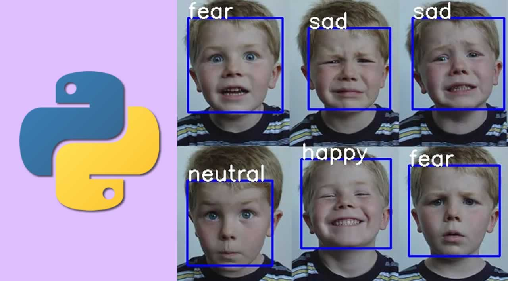

# Real-Time-Emotion-Detection-with-Python
Real Time Emotion Detection with Python

# Installing Dependencies
For using this machine learning concept, you need to install a lot of dependencies into your system using the command prompt. The machine learning algorithm used by me was a tensor flow algorithm, which was designed by Google for machine learning functions. For analyzing faces. you need to detect the faces, to know more about detecting faces using python, you can refer to my article by clicking here. You need a cascade file for this process, you can download it from my git-hub page or in the download section.

You can install the dependencies by using the commands given below:

pip install opencv-python  

pip install tensor flow  

pip install numpy  

pip install pandas  

pip install keras  

pip install adam  

pip install kwargs  

pip install cinit  

# Training the Dataset
For training purposes, I use the predefined un trained dataset CSV file as my main input for my input for training the machine. You can use the code given below for training the machine using the dataset. Before that, you need to ensure that all required files in the same repository where the program presents otherwise it will through some error. You can download the data set by clicking here.
# Detecting Real-Time Emotion
For detecting the emotion, first, you need to run the train.py program to train the data. Then you can use the code.

# Output Verification
Now you can run the videoTester.py program. Your camera automatically turns on and detects the emotion of your face.

# Conclusion
This is just a beginning step in face detection. If you like this project please give a star and if you want to develop the code you can fork.
# Demo 

